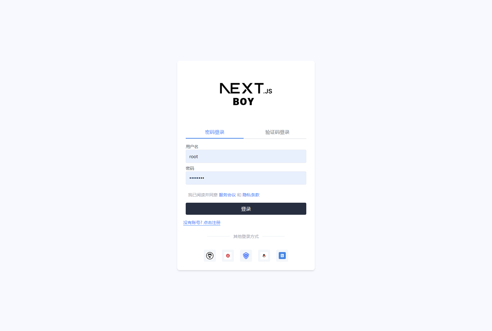
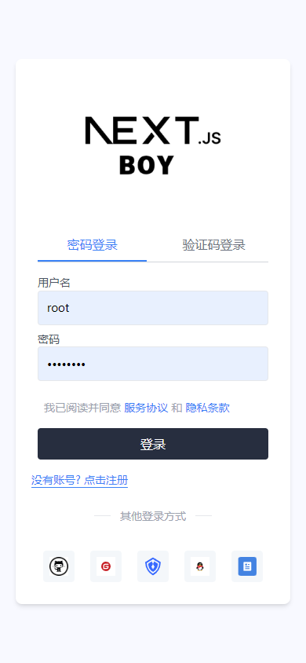
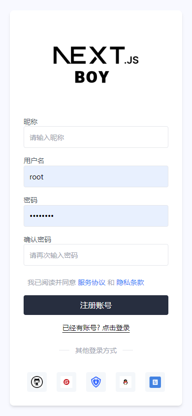
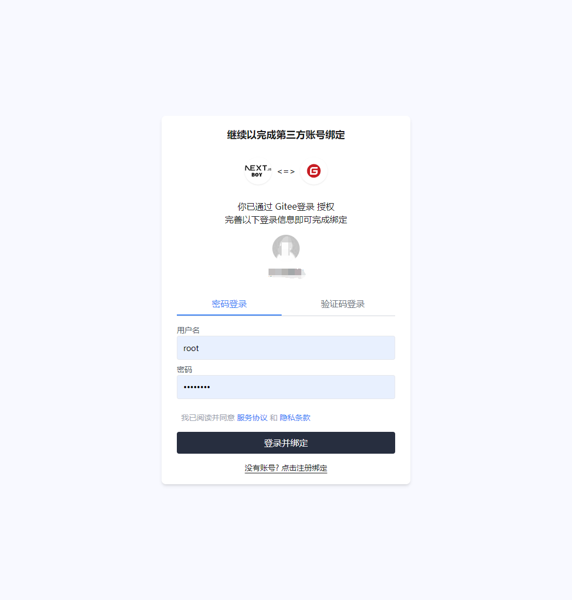

# 🚀 NextAuth OAuth增强

`next-auth-oauth` 是一个基于 Next.js 和 NextAuth 的增强插件，旨在简化和增强授权登录的处理 🔐。该插件提供了丰富的功能，包括第三方登录绑定、账户管理等，让授权流程更加高效和灵活 💪。
为国人🚩提供更爽的集成： 支持 `微信公众号登录` 🐉、`微信网页登录` 🌐、`Gitee` 登录 📚

## 目录

| 包名                                                                                                                                                                                                                | 描述                                                                               |
| ------------------------------------------------------------------------------------------------------------------------------------------------------------------------------------------------------------------- | ---------------------------------------------------------------------------------- |
|                                               | NextAuth 的 OAuth 增强库，提供对第三方登录、账号密码登录的集成，方便集成到自建登录 |
|                                    | 支持通过 QQ 进行 OAuth 认证的插件。                                                |
|                        | 支持通过微博进行 OAuth 认证的插件。                                                |
|                        | 支持通过 Gitee 进行 OAuth 认证的插件。                                             |
|                | 支持通过 Authing 进行 OAuth 认证的插件。                                           |
|                    | 支持通过微信进行 OAuth 认证的插件。                                                |
|              | 公众号二维码验证登录、消息回复验证登录                                             |
|                    | TODO：UI组件，nextjs配套的UI组件                                                   |
|  | TODO：滑动行为验证码                                                               |

## 特性 ✨

- **增强的 `signIn` 登录函数**: 自动处理绑定场景和登录验证，将验证逻辑转发给 `UserService` 🔄
- **增加 Session**: 自动处理 `jwt`/`database` 下不同情况的 `user.id` 填充 🗃️
- **多种授权操作**: 支持登录、登出、注册、解绑第三方账号等 🔑
- **支持多种第三方登录提供商**: 如 GitHub 和 WeChat 🌐
- **自定义绑定授权页面 UI**: 配置 `bindPage` 支持自定义授权绑定页面 🎨
- **国产化第三方登录集成**: 支持 `微信公众号登录` 🐉、`微信网页登录` 🌐、`Gitee` 登录 📚

## 使用方法 🛠️

1. **实现 `IUserService` 接口**: 用于处理用户相关操作 👤
2. **配置授权适配器**: 根据需求设置授权适配器 🔧
3. **导出如下字段**:

   - **`signIn`**: 登录函数，增强后可以自动判断绑定场景/登录验证 🔑
   - **`signOut`**: 登出函数 🚪
   - **`auth`**: 授权函数 🛡️
   - **`listAccount`**: 获得绑定的第三方数据 📊
   - **`unBindOauthAccountInfo`**: 解绑第三方账号 🔓
   - **`handlers`**: 授权函数的中间件 ⚙️
   - **`regist`**: 账户注册函数 📝
   - **`oauthProviders`**: 列出第三方登录提供商 🌐

## TODOS:

- [x] 文档完善，文档网站
  - [ ] 完善`next-auth-oauth` 使用文档
  - [ ] 完善`next-auth-oauth/wechat` 文档
  - [ ] 完善`next-auth-oauth/wechatmp` 文档
  - [ ] 完善`next-auth-oauth/authing` 文档
  - [ ] 完善`next-auth-oauth/github` 文档
  - [ ] 完善`next-auth-oauth/qq` 文档
  - [ ] 完善`next-auth-oauth/weibo` 文档
  - [ ] 完善`wechatmp-kit` 文档
- [x] 案例网站
- [ ] 封装登录，注册，绑定，账户信息组件库(nextjs)`next-auth-oauth/nextjs`
- [ ] 滑动行为验证组件 `next-auth-oauth/slide-verify`

## 案例: 打造基于`nextjs`、`prisma`和`next-auth-oauth`的完整授权系统

## 贡献

欢迎任何形式的贡献！如果你发现了问题或有改进建议，请提交问题报告或拉取请求。

## 许可证

该项目采用 [MIT 许可证](LICENSE) 进行授权。

---

如需更多信息，请参阅 [NextAuth 官方文档](https://next-auth.js.org/) 以了解如何集成授权功能。
