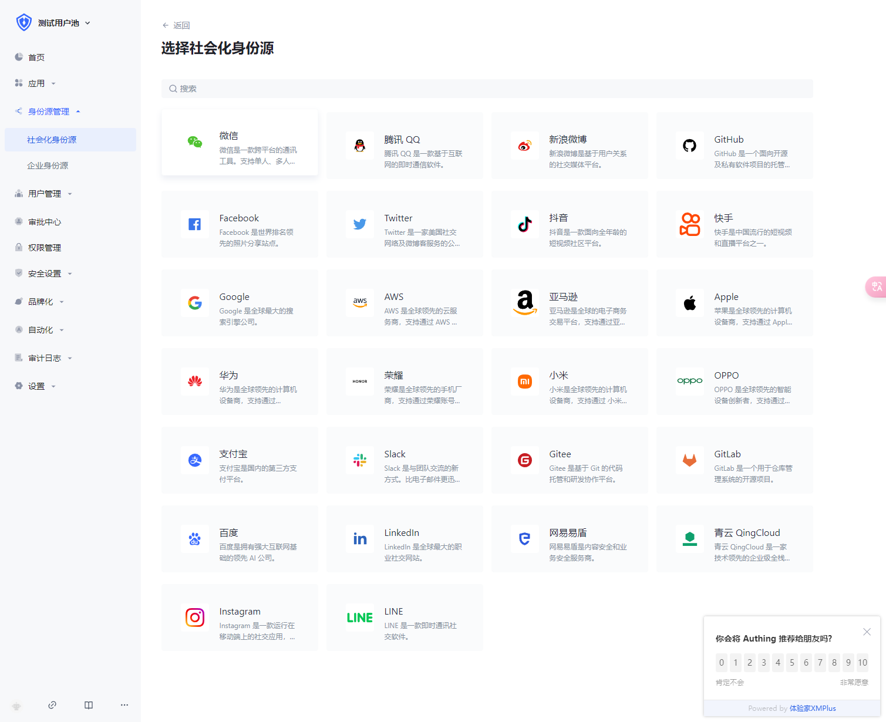
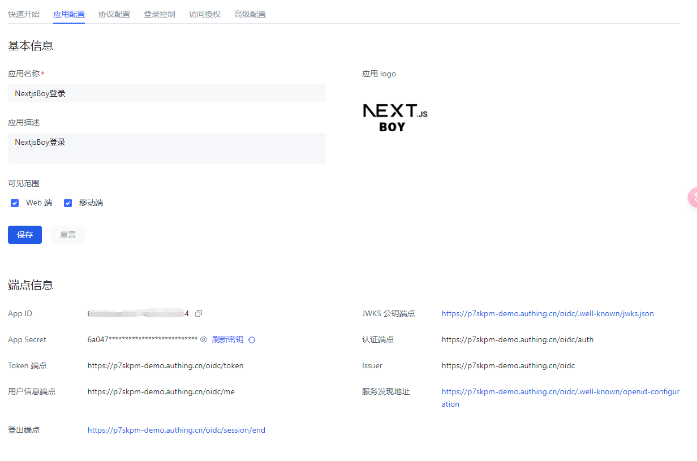

# 使用Authing实现小程序登录

> 使用 Authing 快速实现任何 Web、App 和企业软件的身份认证和用户管理， 为你的客户和员工提供完善的登录解决方案

[Authing](https://www.authing.cn/)

## 1. 注册Authing账号，并配置应用

## 2. 配置应用>身份源管理>社会化身份源



## 3. 配置`next-auth`

```typescript
import NextAuth from 'next-auth'
import { Authing } from 'next-auth-oauth'

export default NextAuth({
  providers: [Authing],
})
```

## 3. 配置`Authing`的环境变量,修改`.env`文件

```
AUTH_AUTHING_ID=下图中的APPID
AUTH_AUTHING_SECRET=下图中的APP SECRET
AUTH_AUTHING_DOMAIN= 下图中的认证配置->认证地址
```

**由于认证配置-认证地址可以自定义，所以每个人会不一样，一定要注意**


