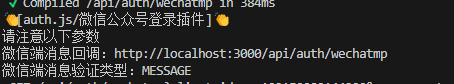

# 使用微信公众号-验证码登录/场景二维码登录

## 原理篇

### 公众号验证码登录的原理


从原理上我们只要抓住几个核心的逻辑就能实现

1. 提供微信消息接受的`webhook`地址，让微信消息能够正确的转发到我们的后台
2. 基于某种缓存机制（比如redis\mysql\memory），提供验证码创建、核验的机制。

想要手工实现上面的功能其实非常的容易，但是如果自己手工实现，会导致代码混乱，难以维护，并且如何跟已有的账户认证体系打通，也是个问题。所以我们选择利用`NextAuth`的第三方授权登录机制，通过`NextAuth`的`Next.js`集成，实现了上述的功能，代码量大大的降低，并且不会有任何的代码冗余，同时也能够和已有的认证体系进行集成。

### `NextAuth`改造思路

`NextAuth`提供了第三方登录的开发能力，我们之前也在此基础上实现了需要标准`oauth/oidc`的登录系统对接，但是，再这次我们的目标并不是标准化的第三方登录，那么改造工作就会变得有点麻烦，我们来思考一下：

1. 利用`NextAuth`的`oauth`登录机制，当用户选择第三方登录后，会跳转到对应的配置项目`authorization`，我们可以将这个页面指定为对应的`二维码展示`页面

2. 开发一个`wechatmp/callback`来接收一个`webhook`消息

3. 开发一个`qecode.html`来渲染二维码页面

4. 需要一种验证码管理机制，来管理创建的验证码以及对应的配对关系


思路上非常简单，核心就是我们实现一个包含验证码分发，验证，二维码页渲染能力，微信消息hook能力的一种特殊的`公众号管理器`，他会以`ApiRoute`被继承到`nextjs`中

我们从流程图中可以看出，公众号管理至少具备以下能力：

- createCaptcha: 创建验证码
- verifyCaptcha(openid,captcha): 验证验证码并绑定openid
- renderQrCode: 渲染关注html页面
- handleWechatMessage: 处理微信消息(webhook)

为了适应`NextAuth`的`oauth`的能力，我们还需要做下面的改造：

- 适配`authorization`页面 -> 校验成功后应该携带`code=验证码`返回`callback页面`
- 适配`token`获取逻辑 -> 也就是通过上面写代码的验证码获得`openid`的能力

## 实践篇

通过上面的思路，我封装了一个开箱即用的`NextAuth`的插件`@next-auth-oauth/wechatmp`

步骤如下：

### 1. 安装`next-auth@beta`

```bash
npm install next-auth@beta
```

### 2. 安装`@next-auth-oauth/wechatmp`

```bash
npm install @next-auth-oauth/wechatmp
```

### 3. 实例化`Wehcatmp`并配置到`auth.ts`文件中

```typescript
import NextAuth from 'next-auth'
import Wehcatmp from '@next-auth-oauth/wechatmp'

export const wechatMpProvder = Wehcatmp({
  // 参数可以手工初始化，也可以让系统自动读取环境变量
})

export const { handlers, signIn, signOut, auth } = NextAuth({
  providers: [wechatMpProvder],
})
```

### 4. 配置`/app/api/auth/wechatmp/route.ts`

```javascript
import { wechatMpProvder } from '@/auth'
export const { GET, POST } = wechatMpProvder
```

### 5 配置环境变量

```shell
AUTH_SECRET="gaXV7FBduowgbb8jfj3mmHXwyyWGhVJCy8WVlOzCg04=" # Added by `npx auth`. Read more: https://cli.authjs.dev
# 微信公众号登录
AUTH_WECHATMP_APPID=
AUTH_WECHATMP_APPSECRET=
AUTH_WECHATMP_TOKEN=
AUTH_WECHATMP_CHECKTYPE=MESSAGE
AUTH_WECHATMP_AESKEY=
AUTH_WECHATMP_ENDPOINT=http://localhost:3000/api/auth/wechatmp
AUTH_WECHATMP_QRCODE_IMAGE_URL=

```

### 6. 创建演示页面

```typescript
import { auth, signIn } from '@/auth'

export default async function Page() {
  const session = await auth()
  return (
    <div>
      <h1>
        账户信息:
        {session?.user ? JSON.stringify(session.user) : '未登录'}
      </h1>
      <div>
        <button
          onClick={async () => {
            'use server'
            await signIn('wechatmp')
          }}
        >
          微信公众号验证码登录
        </button>
      </div>
    </div>
  )
}

```




> 在线仓库： [https://github.com/liuhuapiaoyuan/lesson-nextjs-nextauth/tree/wechatmp](https://github.com/liuhuapiaoyuan/lesson-nextjs-nextauth/tree/wechatmp)

注意分支：`wechatmp`
