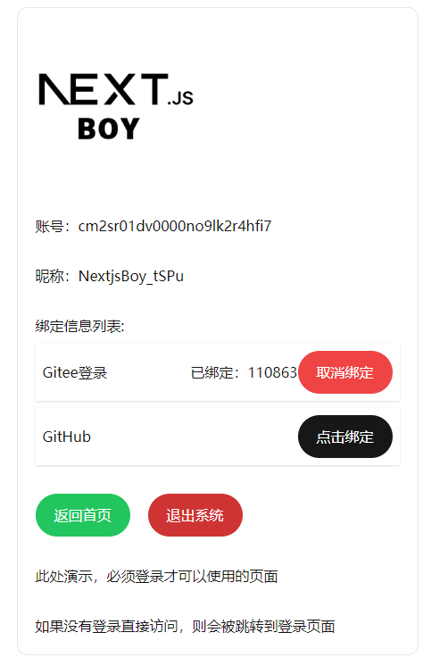
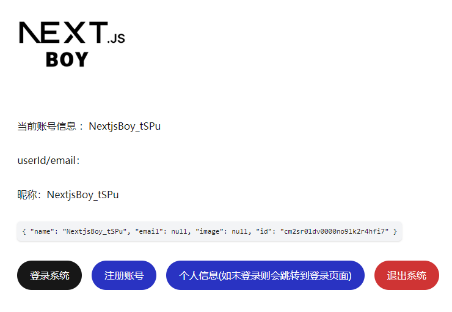
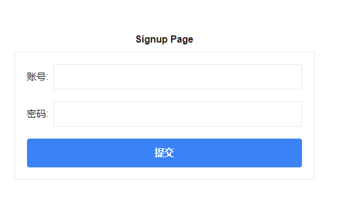

# 完整的授权中心：

### 功能清单：

- [x] 账号、密码注册
- [x] 账号、密码登录
- [ ] 手机、验证码登录
- [x] 第三方登录
- [x] 账户中心：绑定第三方账号
- [x] 账户中心：解除绑定第三方账号
- [x] 退出登录
- [ ] 忘记密码
- [x] 账户安全：修改密码

### 自定义页面：

- [x] 登录页面
  - [x] 账号密码登录表单
  - [ ] 手机、验证码登录表单
- [x]注册页面
  - [x] 账号密码注册表单
  - [ ] 手机、验证码注册表单
- [x]第三方账号绑定页面
  - [x] 组件：`OauthButton`提供第三方账号登录按钮
  - [x] 第三方账号绑定表单: 登录绑定
  - [x] 第三方账号绑定表单: 注册绑定
  - [ ] 微信公众号二维码扫码页面
- [x] 个人中心profile页面
  - [x] 账户信息，查看账户信息
  - [x] 密码修改

### 特性：

#### 1. **ServerAction**：使用`ServerAction`可以实现更加灵活的业务逻辑，比如：发送验证码、绑定第三方账号等等。

1.1 简洁代码，省略`APiRoter`的配置，直接使用`ServerAction`即可。

1.2 灵活，可以自定义`ServerAction`，比如：发送验证码、绑定第三方账号等等。

1.3 安全，`ServerAction`的请求是通过`jwt`验证的，可以防止CSRF攻击。

#### 2. **next-auth** : 基于`next-auth`的机制，来实现一套完善的账号绑定中心

#### **next-auth-oauth/provider** : 自定义扩展的适合国内的第三方登录组件

- `@next-auth-oauth/wechat`：微信登录
- `@next-auth-oauth/gitee`：Gitee登录
- `@next-auth-oauth/authing`：Authing登录
- `@next-auth-oauth/qq`：QQ登录
- `@next-auth-oauth/weibo`：weibo登录

