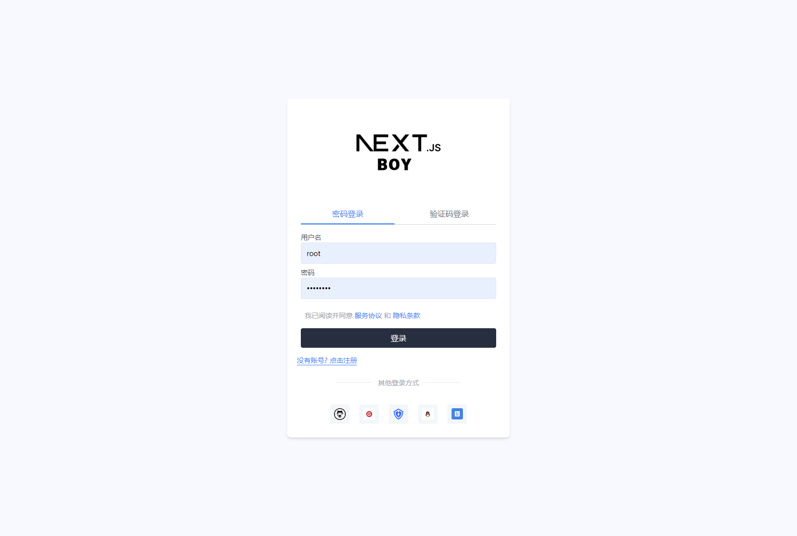
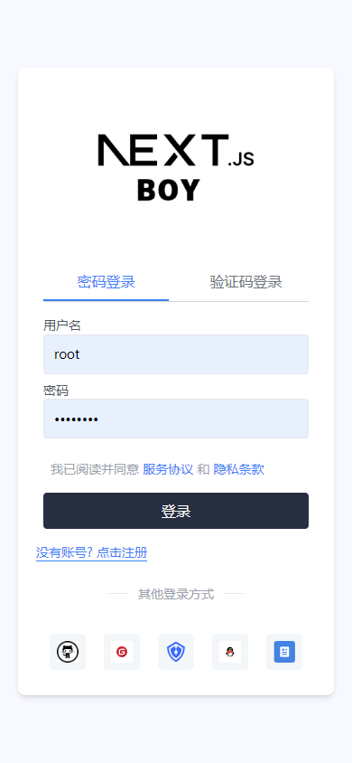
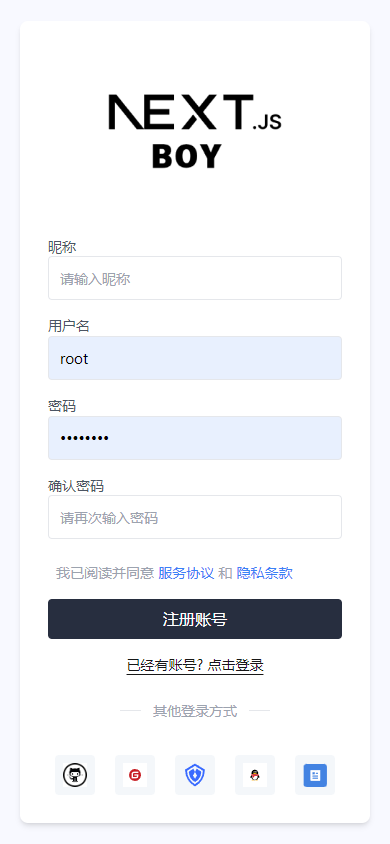
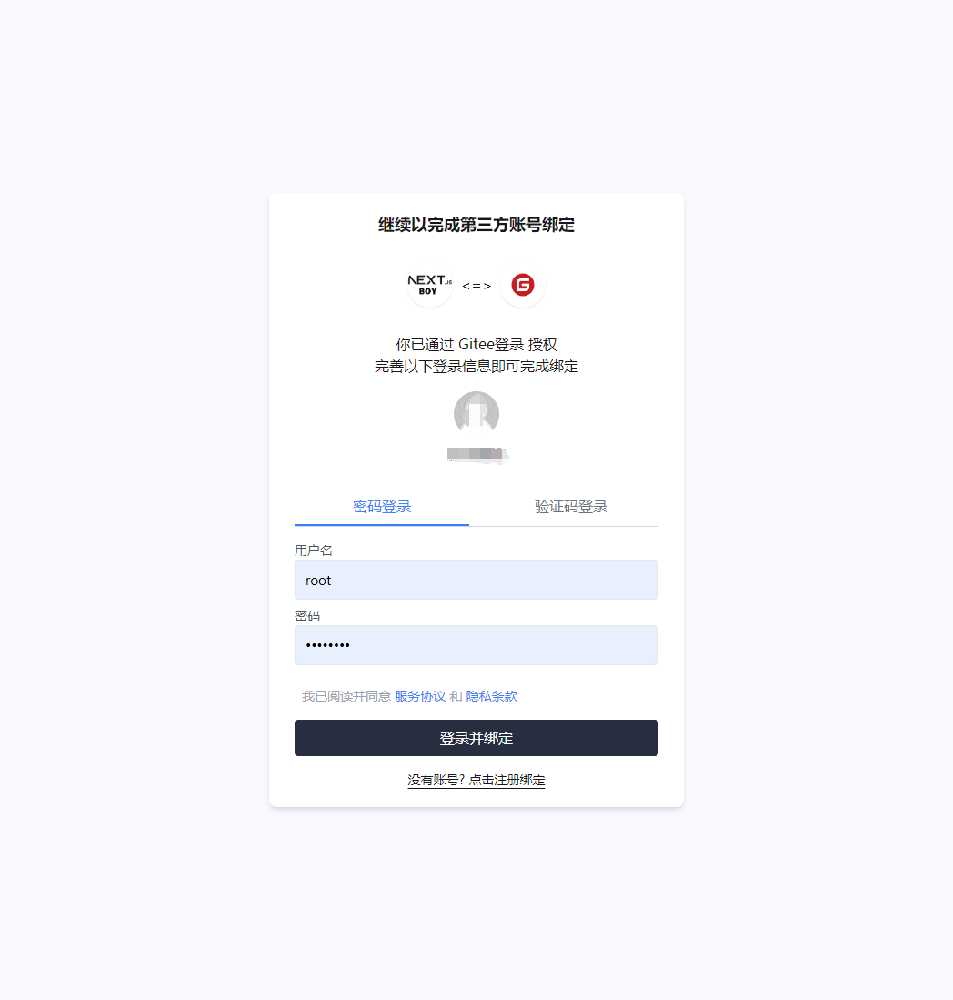

## 快速开始 🚀

### 安装插件：
在你的 Next.js 项目中，首先需要安装 `next-auth-oauth` 及其相关依赖：

```bash
npm install next-auth-oauth @auth/prisma-adapter next-auth@beta
```

或者使用 Yarn：

```bash
yarn add next-auth-oauth @auth/prisma-adapter next-auth@beta
```


### 配置授权适配器

首先，配置你的授权适配器。下面的代码示例展示了如何将 `PrismaAdapter` 与 `next-auth-oauth` 配合使用：

```typescript
import { PrismaAdapter } from '@next-auth/prisma-adapter';
import { AdavanceNextAuth } from 'next-auth-oauth';
import { GitHub, Wechat } from 'next-auth/providers';
import { UserService } from './userService'; // 实现 IUserService 接口的服务类

/**
 * 授权适配器
 */
export const authAdapter = PrismaAdapter(prisma);

/**
 * 导出如下字段：
 * signIn: 登录函数，增强后可以自动判断绑定场景/登录查经
 * signOut: 登出函数
 * auth: 授权函数
 * listAccount: 获得绑定的第三方数据
 * unBindOauthAccountInfo: 解绑第三方账号
 * handlers: 授权函数的中间件
 * regist: 账户注册函数
 * oauthProviders: 列出第三方登录提供商
 */
export const { 
  signIn, 
  signOut,
  listAccount, 
  unBindOauthAccountInfo,
  auth, 
  handlers,
  regist,
  oauthProviders 
} = AdavanceNextAuth({
  ...AuthConfig,
  providers: [
    GitHub,
    Wechat, 
  ],
  /* 自定义绑定授权页面 */
  bindPage: "/auth/bind",
  adapter: authAdapter, 
  userService: new UserService()
});
```

### 实现 `IUserService` 接口

`UserService` 是一个需要实现 `IUserService` 接口的服务类，用于处理用户相关操作。以下是接口定义：

```typescript
export interface IUserService {
  /**
   * 实现登录
   * @param username  账号/邮箱/密码
   * @param password  密码/验证码
   * @param type  登录类型，可以是 password 或 mobile
   */
  login(
    username: string,
    password: string,
    type?: "password" | "mobile"
  ): Promise<DBAdapterUser>;

  /**
   * 注册账号
   * @param user 
   */
  registUser(user: {
    username: string;
    password: string;
    /**
     * 表单提交的数据，比如：
     * @param nickname:string, // 昵称
     * @param email:string, // 邮箱
     * @param mobile:string, // 手机
     */
    formData: Record<string, string>;
    /* 支持其他参数 */
  }): Promise<DBAdapterUser>;

  /**
   * 绑定的第三方授权信息
   * @param userId 
   */
  listAccount(userId: string): Promise<Array<{
    type: string;
    id: string;
    provider: string;
    providerAccountId: string;
  }>>;
}
```

## 示例

你可以在任何`服务端组件/ServerAction`中通过以下代码来实现用户登录和绑定第三方账号：

```typescript


export default function UserProfilePage(){
    // 获得账户信息
    const session = await auth() 
    // 获得绑定信息
    const bindListAccount = await listAccount()

    return <div>
    {JSON.stringify(session)}
    {JSON.stringify(bindListAccount)}
    </div>
}
// 用户登录示例
signIn('github', { callbackUrl: '/' }).then(() => {
  console.log('登录成功');
});

// 用户登出示例
signOut().then(() => {
  console.log('已登出');
});

// 列出绑定的第三方账号,自动判断授权信息
listAccount().then(accounts => {
  console.log('绑定的第三方账号：', accounts);
});

// 解绑第三方账号
unBindOauthAccountInfo().then(() => {
  console.log('解绑成功');
});
```

## 案例: 打造基于`nextjs`、`prisma`和`next-auth-oauth`的完整授权系统






## 贡献

欢迎任何形式的贡献！如果你发现了问题或有改进建议，请提交问题报告或拉取请求。

## 许可证

该项目采用 [MIT 许可证] 进行授权。

---

如需更多信息，请参阅 [NextAuth 官方文档](https://next-auth.js.org/) 以了解如何集成授权功能。 